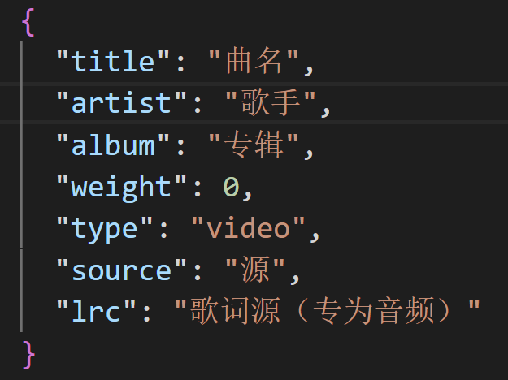

# ClassAlbum

用于 **个人歌单展示** 的前端项目，通过左右双栏展示歌单。
> 根据曲库随机推送曲目是本项目的特色。

## 效果


*注：自定义Style略有不同*

Demo：[runlingdev.github.io/ClassAlbum](https://runlingdev.github.io/ClassAlbum)

## 自定义

> 项目建议的使用方式：clone到本地进行自定义修改，让它成为你的展示歌单的地方。

### 添加歌单

你可以通过修改 `songs.json` 来实现自定义歌单：




| 参数 | 解释 | 示例 |
| ---- | ---- | ---- |
|`title`|歌曲名称|反方向的钟|
|`artist`|艺术家|周杰伦|
|`album`|专辑名|Jay|
|`videoSource`|视频地址|video/反方向的钟.mp4|
|`isFixed`|是否置顶|false|

> 注：
>
> `videoSource` 是内置播放器iframe的播放地址，可以是本地路径或网络地址，本地路径请使用绝对路径，或与 `detail.html` 的相对位置。
>
> `isFixed` 指示了歌曲是否置顶--若 `isFixed` 值为 `false` ，则参与随机歌单派送。反之，则会一直在左栏的上部出现（注意：当Fixed曲目过多时，并不会自动去往右栏......）

*Warning:出于对安全问题的考虑，CORS不允许对本地文件的请求[#1](https://github.com/RunlingDev/ClassAlbum/issues/1)。您需要采取些许行动，以在本地应用您的歌单。*

1. 上传您的歌单

你可以借助些许工具，例如Github，将您自己的 `songs.json` 上传并获取raw地址(打开后只有文件内容没有其他杂质，也可以是文件直链)，替换 `indexjs.js` 及 `detailjs.js` 中的 `songs.json` 。它位于前者的第二行及后者的第六行。一般而言，GitHub的文件raw下载地址在这个地址：

> https://raw.githubusercontent.com/\<Yourname>/\<Yourrepo>/\<Yourbranch>/\<Yourfile>

2. 允许请求本地文件

一个普遍性的办法是在Chrome快捷方式中添加 `--allow-file-access-from-files` 参数。这对于我们的项目而言没有安全隐患。参照[CSDN](https://blog.csdn.net/chenmoupeng/article/details/107317247)。


### 更改字体

在Styles.css中，出现了并未定义的字体 `Custom1` `Custom2` 。你只需要很容易的在css中添加字体声明，并在 `font` 文件夹（你需要创建它）下放置你享用的字体，就可以享受了--首页采用 `Custom2` ，详情页的曲目采用 `Custom1` 。当然你也可以自行修改......

```css
@font-face {
    font-family: "Custom1";
    src: url('font/<Yourfont1>.ttf');
}

@font-face {
    font-family: "Custom2";
    src: url('font/<Yourfont2>.ttf');
}
```

## Donate

如果这个新手项目对你有所启发，还请多多支持！

[Afdian](https://afdian.net/a/runling/plan)

---